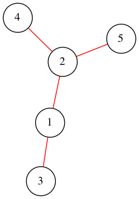

# Graph-Network-COVID-19
Creating a simple graph network to model the relationship between susceptible, infected, and recovered patients.

## Prerequisites
You will need to install the following packages if you don't already have them
```
pip install pandas
pip install numpy
pip install networkx
pip install matplotlib
pip install pygraphviz
```
## Running the code
To generate the graph, in terminal (or with your preferred IDE), run create_graph_network.py

## Output
Once executed, the code will generate a file.png with an image of the network and a file.dot which is a saved version
of your network.

## Model Information
This program creates a graph network based on the output of a simple contract tracing model. Each item in the JSON file will
contain an id representing the unique person in addition to some other data, like who else they were in contact with etc.
Each entry in the JSON file will look something like this:
```
[
   {
      "id":1,
      "infectorId":null,
      "infecteeIds":[
         2,
         3
      ],
      "dayInfected":0,
      "dayContag":4,
      "dayIso":9999,
      "dayDiag":9999,
      "dayTraced":9999
   }
]
 ```
 
## Generated Graph
There are a couple of libraries that allow you to create simple graph networks but I found pygraphviz the easiest to start 
using and it's well documented. Using some mockup results, my program generates the following graph.


## Contributions
The JSON data was provided by [Covid Watch](https://github.com/covid19risk/) in their ongoing effort to build a scalable 
solution to the COVID-19 pandemic.
